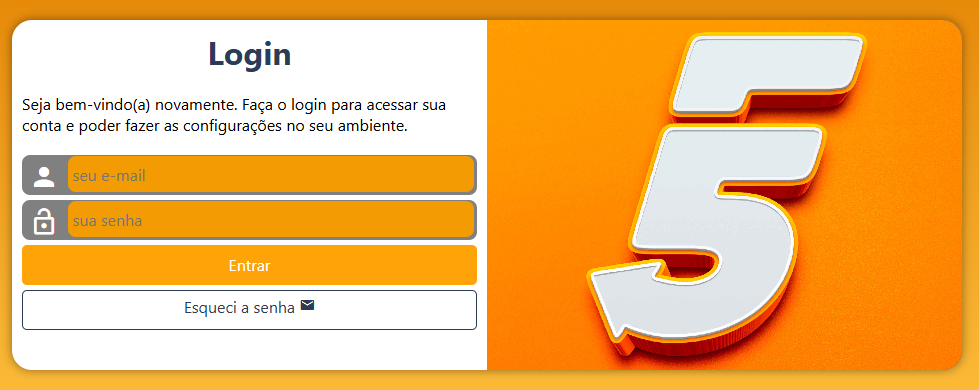

# Tela de Login Responsiva

Este projeto é uma tela de login moderna, responsiva e com validações de credenciais para garantir um acesso seguro.

## 📌 Funcionalidades
- Layout totalmente responsivo, adaptável a diferentes dispositivos.
- Campo de e-mail com validação de domínio válido.
- Campo de senha com restrições de quantidade mínima e máxima de caracteres.
- Design moderno e intuitivo para melhor experiência do usuário.

## 🚀 Tecnologias Utilizadas
- HTML5
- CSS3
- JavaScript

## 🔍 Validações Implementadas
1. **E-mail:** Permite apenas domínios específicos para acesso.
2. **Senha:** Deve conter um número mínimo e máximo de caracteres para segurança.

## 📷 Captura de Tela


## 🛠 Como Executar o Projeto
1. Clone este repositório:
   ```sh
   git clone https://github.com/sergiochrystian/projeto-login.git
   ```
2. Acesse a pasta do projeto:
   ```sh
   cd projeto-login
   ```
3. Abra o arquivo `index.html` em um navegador.

## 📄 Licença
Este projeto está sob a licença MIT. Sinta-se à vontade para utilizá-lo e modificá-lo conforme necessário.

---
**Desenvolvido por [Sérgio Chrystian]** 🚀

